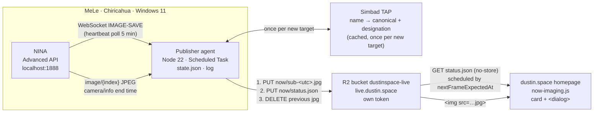

# Currently Imaging — design spec

**Approved by Dustin 2026-09-01 ("go!")** after four design decisions (idle state,
placement, caption, publisher runtime) and one amendment round (event-driven agent,
exposure-aware client refresh, exposure-scaled liveness, `nextFrameExpectedAt`).
Companion brief with the card mockup and flow diagram: Claude artifact
"Currently Imaging" (https://claude.ai/code/artifact/a0c9fb9e-3874-4f17-8ff3-27643f8e1928).

This spec is the anti-drift anchor for implementation. Every "verified" claim below
names how it was verified; anything not verified is marked as such.

---

## 1. Goal

A section on the dustin.space homepage that shows what the Chiricahua rig is imaging
right now: the target's colloquial name and its best-known catalog designation, the
latest single light frame (NINA's own stretched preview), a one-line technical caption,
and a "What's this?" link opening an explainer that covers (a) why one raw frame looks
the way it does, (b) stacking — where the word comes from (physically layering
photographic plates) and how it is done digitally today (registration, integration,
pixel rejection), and (c) "Why black-and-white?".

Design intent (project CLAUDE.md): wonder and exploration. This is the most *live* thing
on the site — "it's real, it's out there, and it's happening now."

## 2. Non-goals (deliberately excluded)

- Mount position, guiding RMS, sensor temperature, sequence progress bars on the card.
  The data exists in the API; the card is not a dashboard.
- Any remote control (that is "Project B", deferred, see memory entity
  `dustin-space-currently-imaging-plan`).
- A Cloudflare Worker or KV. Two objects in a bucket do the job.
- (Amendment 2026-09-01: NINA's WebSocket IS used — see §5.2. It replaced the
  original 30-second poll after Dustin's "bound it to known constraints" review;
  the heartbeat poll remains as the safety net.)
- A NINA plugin. Researched 2026-09-01 (feasible: C#, net8.0-windows, WPF, hooks
  `IImageSaveMediator.ImageSaved`; Ground Station's `Images/ImageEventHandler.cs` is a
  working reference for stretching + JPEG-encoding in-process). Rejected for failure
  isolation: a bug in our code would live inside NINA's process on a rig 1,500 miles
  away. No existing plugin publishes the latest frame to user-owned storage (full
  manifest catalog grepped: Astrovault = its own paid cloud; Remote Copy = robocopy;
  Ground Station = Discord/Slack image posts, HTTP instruction is text-only;
  Lightbucket = metadata only).
- Twilight/solar gating of the agent (Dustin's idea, assessed 2026-09-01): rejected
  because Dustin images the Sun in daytime and shoots dusk/dawn flats, and because idle
  cost is already ~zero (see §5.3). The useful half of the idea lives in §6.3 and §6.4.

## 3. Verified facts (2026-09-01, all read-only probes)

| Fact | How verified |
|---|---|
| MeLe (desktop-hduhc1k, 100.106.198.18) is online on the tailnet; Windows 11 build 26200; PowerShell 5.1; **no Node, no Python, no .NET SDK** | `tailscale status`, `ssh mele` (alias in Dustin's SSH config) |
| NINA Advanced API answers on port 1888, version **2.2.15.2**, reachable over the tailnet (bound to all interfaces) | `GET /v2/api/version` |
| `GET /v2/api/image-history?all=true` returns an array (69 entries at probe time, NINA-process lifetime) with fields: `CameraName, Date (ISO w/ offset), ExposureTime, Filename, Filter, FocalLength, Gain, HFR, HFRStDev, ImageType, IsBayered, Max, Mean, Median, Min, Offset, RmsText, StDev, Stars, TargetName, TelescopeName, Temperature`. **No coordinates.** `ImageType` values seen: `SNAPSHOT`; light frames are `LIGHT` (per Advanced API docs + TnS filter param `imageType`) — **the LIGHT value is unverified live** until a real night | saved to scratch, summarized |
| `GET /v2/api/image/{index}?resize=true&scale=0.5&quality=80` returns **JSON** `{Response: "<base64 JPEG>", ...}` for history index `index` | probe, 1.9 MB response for a bias frame |
| `GET /v2/api/prepared-image?resize=true&scale=S&quality=Q` returns a raw JPEG of the *last prepared* image; **`scale` is a 0–1 fraction of the prepared image** (0.25 → 785 px from a 3140 px prepared image; unresized prepared image was 3140×2105 for a 6280×4210 sensor) | `file` on the saved JPEGs |
| `GET /v2/api/equipment/camera/info` exposes `IsExposing` (bool) and `ExposureEndTime` (absolute ISO timestamp) — **no current-exposure duration field**. Touch'N'Stars infers duration from the first remaining-time value it observes | probe + TnS `cameraStore.js` |
| `GET /v2/api/sequence/json` lists containers/items; with Dustin's real sequence unloaded it is a skeleton (Cool Camera / Open Dome Shutter / Run Autofocus / Warm Camera). Shape under Target Scheduler **unverified** | probe |
| WebSocket `ws://<host>:1888/v2/socket` accepts a connection (open in 300 ms, stays open). TnS subscribes with `{"action":"subscribe","eventType":"IMAGE-SAVE"}` and reads events as `message.Response.Event`. **Event payload unverified live** | Node 22 built-in WebSocket probe; TnS `websocketChannelSocket.js`, `store.js` |
| Site CSP already allows `https://tiles.dustin.space` in `img-src` and `connect-src`; a new host needs one edit to `src/_headers` | read |
| Cloudflare does **not** edge-cache `.json` by default; it does cache `.jpg` (default TTL 120 min when no Cache-Control) | Cloudflare docs, "Default Cache Behavior" |
| R2 API tokens scope to buckets, not prefixes | Cloudflare R2 docs (token permissions are per-bucket) |
| Repo test runner: `node --test 'tests/**/*.test.js'`; Playwright available; `assetHash.js` is the content-hash registry; scripts are gated by front-matter flags in `base.njk` (`galleryPage`) | read |
| Local Node is v22.22.2 (built-in `fetch` and `WebSocket`) | `node --version` |

## 4. Architecture



Nothing on the rig is reachable from the internet. The agent only makes outbound
requests. The status file points at a *versioned* JPEG key, so the CDN may cache JPEGs
indefinitely and the page still never shows a stale frame.

## 5. Component A — publisher agent (`now-imaging/` in this repo)

### 5.1 Files

```
now-imaging/
  agent.js              entry point: wires socket + heartbeat + publish loop
  lib/nina.js           NINA API client: history, imageByIndex, cameraInfo, socket
  lib/select.js         PURE: pick latest LIGHT, subsTonight, nextFrameExpectedAt
  lib/resolve.js        target-name → {name, designation}: overrides → cache → Simbad
  lib/status.js         PURE: build + validate status.json (privacy assertion)
  lib/publish.js        R2 upload/delete sequence (S3 client injected for tests)
  lib/state.js          state.json read/write (last published filename + key)
  lib/log.js            append-only log with size-bounded rotation
  config.example.json   documented template (committed)
  config.json           real config (GITIGNORED)
  overrides.json        manual name overrides (committed, may be empty)
  install-task.ps1      registers the Windows Scheduled Task (commented for Dustin)
  README.md             install, run, dry-run, troubleshooting
tests/now-imaging/*.test.js   node --test, fixtures from the 2026-09-01 saved history
```

Dependencies: `@aws-sdk/client-s3` only (same as ingest). `fetch` and `WebSocket` are
Node 22 built-ins. Package: `now-imaging/package.json` with its own lockfile so the
MeLe install is `npm ci` of a tiny tree. Node LTS 22 on the MeLe.

Config keys (`config.json`): `ninaBaseUrl` (default `http://localhost:1888`),
`r2AccountId`, `r2AccessKeyId`, `r2SecretAccessKey`, `r2Bucket` (`dustinspace-live`),
`publicBaseUrl` (`https://live.dustin.space`), `imageScale` (0–1, default 0.4),
`jpegQuality` (default 80), `heartbeatSeconds` (300), `dryRunDir` (optional: when set,
publish writes files here instead of R2), `logPath`, `statePath`.

### 5.2 Event loop (intentionally infinite, commented as such)

1. On start: load state.json (may be absent). Connect WebSocket to
   `/v2/socket`, send `{"action":"subscribe","eventType":"IMAGE-SAVE"}`. Run one
   `check()` immediately so a restart mid-night catches up.
2. On any `IMAGE-SAVE` message → `check()` (debounced 2 s; a burst collapses to one).
3. Heartbeat: every `heartbeatSeconds` → `check()` regardless. This is the safety net
   for a dropped socket and the only path that runs if the socket protocol turns out to
   differ from TnS's (§3 unverified). Cost when idle: one local GET per 5 min.
4. Socket reconnect: exponential backoff 1 s → 60 s cap, jittered, forever; every
   state change logged at info. A socket that never connects degrades to heartbeat
   polling, not to silence.

`check()`:
1. `GET image-history?all=true` (timeout 10 s). Select the newest entry with
   `ImageType === "LIGHT"` (case-insensitive) by `Date`. If none, or its `Filename`
   equals `state.lastFilename`, return (no writes).
2. `GET image/{index}?resize=true&scale=<imageScale>&quality=<jpegQuality>` where
   `index` is the entry's position in the history array. Decode base64 → Buffer.
   Reject if not a JPEG (magic bytes) or > 3 MB (bounded).
3. `GET camera/info` → if `IsExposing` and `ExposureEndTime` parses, set
   `nextFrameExpectedAt = ExposureEndTime + 15 s` (download + save slack). Else omit.
4. Resolve target name (§5.4).
5. Build status (§7), validate (privacy + schema), publish (§5.5), then write state.
6. Log one info line: `published <key> target="<raw>" → "<name> / <designation>" filter=<f> exp=<s>s subsTonight=<n>`.

Any step failing: log at warn with the error, keep state unchanged, return. Consecutive
failures ≥ 5 → one additional warn line `check failing repeatedly (n=…)` (Dustin's
observability preference: never silent). Never throw out of the loop; `process.on
('unhandledRejection')` logs and continues.

### 5.3 Why not poll continuously / why not gate on twilight

Idle cost of the design as specified: one local GET per 5 min plus an open socket.
Dustin proposed bounding activity by exposure length and nautical twilight (2026-09-01);
assessed as more breakage surface (daytime solar imaging, dusk/dawn flats, next
exposure may differ from the last, irregular gaps for dither/autofocus/flip) for a
saving measured in milliseconds. The event-driven socket is the principled version of
"don't poll": it sleeps until NINA says a frame landed.

### 5.4 Target-name resolution (`lib/resolve.js`)

NINA's `TargetName` is freeform (whatever Dustin typed into Target Scheduler).
Resolution order:
1. `overrides.json`: exact (case-insensitive, whitespace-normalized) match →
   `{name, designation}`. Committed file; Dustin edits it when Simbad is wrong.
2. Disk cache (`resolve-cache.json` beside state) keyed by normalized raw name.
3. Simbad TAP (`https://simbad.cds.unistra.fr/simbad/sim-tap/sync`, ADQL against
   `ident`/`basic`/`ids` for the raw string): collect the identifier list; pick
   **name** = first `NAME …` entry (colloquial) if any, else the designation; pick
   **designation** = first identifier matching the catalog priority order used by the
   library naming convention (memory, 2026-05-27): Messier > Caldwell > NGC > IC >
   Sharpless (Sh 2-) > Barnard > LBN/LDN > vdB > Arp > HCG > Abell > UGC/MCG/ESO/PGC
   > raw. Port the list from `~/Claude/itelescope-sync` at implementation time (locate
   the resolver with grep; do not re-derive the order from memory alone).
4. Simbad failure or no match → `{name: raw, designation: null}`; card shows the raw
   name alone. Never block publishing on Simbad (timeout 8 s).

Non-target names (`Snapshot`, `Bias`, `Flat`, `Dark`) never reach this code because
only `LIGHT` frames are selected.

### 5.5 Publish protocol (`lib/publish.js`)

Order is load-bearing: a reader must never see a status pointing at a missing image.
1. `PUT now/sub-<YYYYMMDDTHHMMSSZ>.jpg`, `Content-Type: image/jpeg`,
   `Cache-Control: public, max-age=31536000, immutable` (versioned key).
2. `PUT now/status.json`, `Content-Type: application/json`,
   `Cache-Control: no-cache` (belt-and-braces; JSON isn't edge-cached by default).
3. `DELETE` the previous JPEG key from state (ignore 404). Failure here is logged
   and retried on the next publish (state keeps a `pendingDelete` list, bounded to 20).
4. Write state: `{lastFilename, lastKey, pendingDelete[]}`.

Dry-run mode (`dryRunDir` set, or `--dry-run`): steps 1–3 write/delete files under that
directory instead. Used from Fedora against `ninaBaseUrl=http://100.106.198.18:1888`
before anything is installed on the MeLe.

### 5.6 Install on the MeLe (Dustin's go required; runs over SSH)

1. `winget install OpenJS.NodeJS.LTS` (needs his go: system change on the rig).
2. Copy `now-imaging/` (without config) to `C:\Users\<user>\now-imaging\`; `npm ci`.
3. Write `config.json` there (token pasted by Dustin or via a one-time secure channel;
   never committed, never echoed into chat). File ACL: his user only.
4. `install-task.ps1`: Scheduled Task "dustin.space now-imaging", trigger At startup,
   run whether user is logged on or not, restart on failure every 1 min ×  unlimited,
   `node agent.js`, working dir set. Verify with `schtasks /query` + a log line.
5. Verify from Fedora: `curl https://live.dustin.space/now/status.json` after the first
   real light frame (see §9 gap).

## 6. Component B — site

### 6.1 Markup (`src/index.njk`)

New `<section class="now-imaging" id="now-imaging" hidden aria-labelledby="now-imaging-label">`
placed **between the hero and Latest Captures** (Dustin's pick). Contents:
- status row: `<span class="now-dot" aria-hidden>` + `<span id="now-imaging-label">`
  ("Currently imaging" / "Last imaged · 6 h ago");
- `, unprocessed">` inside a
  fixed-aspect frame (3:2 by default; the agent publishes width/height so the page can
  set `aspect-ratio` before the image loads → no layout shift);
- name (`<h2>`), designation, caption line `Hα · 300 s · 23rd sub tonight`;
- `<button class="now-whats" aria-haspopup="dialog">What's this?</button>`;
- `<dialog id="now-dialog" aria-labelledby="now-dialog-title">` with the explainer
  (§6.5), a close button, and the three sections.

The section stays `hidden` until status loads; without JS it never appears. The
"live" filename tag on the frame ("SINGLE 300 s EXPOSURE · UNPROCESSED") is optional
polish, at implementation discretion.

### 6.2 Script (`src/assets/js/now-imaging.js`, gated by `homePage: true`)

Vanilla JS, `defer`, content-hashed (`assetHash.nowImagingJs`). Behavior:
1. `fetch(STATUS_URL, {cache: 'no-store'})`, timeout 8 s via AbortController.
   Non-200 or invalid JSON → section stays hidden; `console.info` once. Never an error
   card.
2. Render: name, designation (omit element if null), caption, image (swap `src` only
   when `frame.url` changed), label + dot state.
3. **Liveness:** `live = ageMs < max(20 min, 3 × exposureSeconds)`. Live → label
   "Currently imaging", dot pulses (CSS, respects `prefers-reduced-motion`). Idle →
   "Last imaged · <relative time>" via `Intl.RelativeTimeFormat`, dot static.
4. **Refresh schedule (exposure-aware, Dustin's amendment):**
   - if `nextFrameExpectedAt` present and in the future → next fetch at that time + 20 s;
   - else if live → at `updatedAt + exposureSeconds + 30 s`, floored at 60 s from now;
   - else (idle) → 5 min.
   Only while `document.visibilityState === 'visible'`; on `visibilitychange` to
   visible, fetch immediately if the last fetch is older than 60 s. Timer is a single
   `setTimeout` rescheduled after each fetch (bounded: one in flight at a time).
5. Dialog: `showModal()` on click; closes on Escape, backdrop click, and the close
   button; focus returns to the trigger; `inert` not needed (native dialog).

### 6.3 CSS (`src/assets/css/main.css`)

Section rhythm matches `.recent-work` (container width, vertical spacing). Two-column
card (frame 3fr / meta 2fr) collapsing to one column ≤ 560 px. Tokens only (`--accent`,
`--text-*`, `--bg-surface`). Live dot uses a green semantic color distinct from the
accent. Dialog: `--bg-elevated`, max-width 64ch, scrollable body, backdrop
`rgba(var(--bg-base-rgb), .7)`. Entrance uses the site's existing fade/rise pattern from
a visible resting state (no `opacity: 0` parking).

### 6.4 `_headers`

Add `https://live.dustin.space` to `img-src` and `connect-src`. Note in the file's HSTS
comment that the subdomain inventory grew by one HTTPS host (`includeSubDomains` still
safe). `tests/headers.test.js` gets an assertion for the new host.

### 6.5 Explainer content (`What's this?` dialog)

Voice per project CLAUDE.md: astronomer + layperson at once, wonder register. Three
sections, ~350 words total:
1. **Why this frame looks rough** — one exposure, minutes long, straight off the
   sensor; the gallery images are dozens of these combined.
2. **Stacking: from glass plates to pixel rejection** — origin of the word (astronomers
   physically layering photographic plates/negatives of the same field to accumulate
   faint signal); today: register each frame star-to-star, integrate per pixel with
   outlier rejection so a satellite trail or cosmic-ray hit present in one frame is
   discarded; noise falls with √N. **Fact-check rule:** every historical claim is
   checked against a citable source before the copy ships (a reference list goes in the
   plan doc, not on the page).
3. **Why black-and-white?** — monochrome sensor by choice: a colour sensor spends ¾ of
   its pixels behind a fixed filter mosaic; mono sees every photon at full resolution;
   colour is built by shooting through filters one at a time (R/G/B or the narrow
   Hα/OIII/SII bands nebulae emit in); a single sub is one band, hence greyscale.

## 7. `status.json` schema (v1)

```json
{
  "schemaVersion": 1,
  "updatedAt": "2026-09-02T05:41:12Z",
  "nextFrameExpectedAt": "2026-09-02T05:46:27Z",
  "target": { "raw": "Veil Nebula", "name": "Veil Nebula", "designation": "NGC 6960" },
  "frame": {
    "url": "https://live.dustin.space/now/sub-20260902T054112Z.jpg",
    "width": 1256, "height": 842,
    "filter": "Ha", "exposureSeconds": 300,
    "subsTonight": 23, "hfr": 2.1, "stars": 412
  },
  "equipment": { "camera": "QHY268M", "telescope": "Orion Eon 70", "focalLengthMm": 350 }
}
```

- `updatedAt` = the frame's NINA `Date` converted to UTC (not publish time).
- `subsTonight` = count of LIGHT entries with the same `TargetName` and `Filter` whose
  `Date` ≥ the most recent local noon (rig-local offset taken from the `Date` string's
  own offset). Reset naturally each day. **Deviation from the ask** ("sub 23 of 40"):
  planned totals aren't reliably available under Target Scheduler; flagged to Dustin in
  the brief, not overruled.
- `hfr`/`stars` are published (cheap, already in history) but **not rendered** (Dustin
  chose the filter/exposure/count caption). Keeps a later "denser caption" a CSS/JS
  change only.
- **Privacy invariant:** the schema has no latitude/longitude/site/elevation/observer
  fields; `lib/status.js` rejects any object containing keys matching
  `/lat|lon|long|site|elev|observer/i` at any depth (defense against a future field
  being added carelessly). Unit-tested. Past the recursion bound the walk FAILS
  CLOSED (rejects), never open (Task 2 review, 2026-09-01).
- **Field-naming rule (2026-09-01, Task 2 review):** the regex is a substring match
  on purpose (it must catch `sitelat`), so it also rejects innocent names such as
  `latestFrame`, `plateSolution`, `website`. A rejected publish is loud (the agent
  logs `status rejected: forbidden key …`) and in the safe direction. When adding
  a field, pick a name the regex does not match (`newestFrame`, `solve`, `url`);
  do not weaken the regex to admit a name.

## 8. Infrastructure (Dustin's dashboard or Cloudflare API with his go)

1. R2 bucket `dustinspace-live` (same account as `dustinspace`).
2. Custom domain `live.dustin.space` on that bucket (zone is already on Cloudflare).
3. R2 API token: **Object Read & Write, scoped to `dustinspace-live` only**. Stored only
   in `now-imaging/config.json` on the MeLe (and optionally in Dustin's password
   manager). Rationale: a token on a remote rig must not be able to overwrite gallery
   tiles; R2 cannot scope a token to a prefix.
4. CSP edit (§6.4).
5. Optional: a Cache Rule is *not* needed; defaults do the right thing (JSON uncached,
   JPEG cached and versioned).

## 9. Testing and verification

**Unit (node --test, fixtures = the saved 2026-09-01 history + synthetic LIGHT entries):**
- `select.js`: newest LIGHT chosen; SNAPSHOT/BIAS/FLAT ignored; `subsTonight` counts
  across the local-noon boundary correctly (fixtures spanning midnight and noon);
  `nextFrameExpectedAt` only when `IsExposing`.
- `resolve.js`: override wins; cache hit skips network; priority order (Messier over
  NGC, Caldwell over NGC, NAME entry becomes `name`); Simbad failure → raw fallback.
- `status.js`: schema shape; privacy assertion rejects a planted `siteLatitude`.
- `publish.js` with a fake S3 client: order image → status → delete; delete failure
  lands in `pendingDelete` and is retried; dry-run writes files.
- Every new pin is **red-proven** (revert the guarded code, watch the test fail) before
  commit — the vacuous-test tendency is a documented one.

**Site:**
- `build-smoke.test.js`: section markup present on `/`, script include present only on
  the home page, `_headers` carries the new host.
- Playwright probe with a local fixture `status.json` served from a test server: hidden
  when 404; renders when present; live vs idle label; dialog opens/closes with keyboard;
  no layout shift (measured `img` box before/after load).

**Live, from Fedora, before touching the MeLe:** dry-run against the tailnet address.
Confirms history parsing, the by-index JPEG decode, camera-info end-time parsing,
Simbad resolution for a real name, and the socket subscribe (if a frame lands).

**Known gap (stated to Dustin):** NINA's history holds only bias/snapshot frames from
2026-08-26, so the first `LIGHT` end-to-end waits for the next night a light frame is
saved. Until then `LIGHT` selection, the socket event payload, and the real-frame JPEG
size are fixture-tested only. Plan: the first imaging night after deploy is a
watch-the-log night; `imageScale` gets tuned then.

## 10. Security and privacy

- Rig never exposed inbound; agent only makes outbound HTTPS to R2 and Simbad, and
  local HTTP to NINA.
- Token blast radius limited to the live bucket (§8).
- No coordinates leave the machine (§7 invariant; §3 verified the history endpoint
  carries none; the profile endpoint is never called).
- Filenames from NINA appear in logs only, not in `status.json`.
- QA tier for the implementation: **ELEVATED** — code-reviewer + test-analyzer +
  security-auditor (networked/deployed code, credentials at rest on a remote host).

## 11. Dustin-side steps (collected)

1. Say go for the Node install + Scheduled Task on the MeLe.
2. Create the bucket, domain, and scoped token (or authorize me to do it via the API);
   paste the token into the MeLe config.
3. Optionally seed `overrides.json` with names Simbad won't resolve the way he wants.
4. First imaging night after deploy: glance at the homepage; I read the log.

## 12. Deviations from the original ask

| Ask | Delivered | Why |
|---|---|---|
| "sub 23 of 40" style count (implied by caption option) | "23rd sub tonight" | planned totals not reliably available from the API under Target Scheduler |
| everything else | as asked | — |
